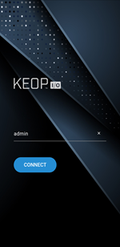
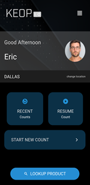
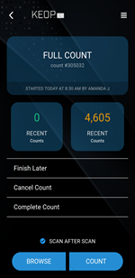

# test_app

A new Flutter project.

## Getting Started

This project is a starting point for a Flutter application.

### 1. A few resources to get you started if this is your first Flutter project:

- first of all, you have to install flutter.

this is reference URL: 'https://docs.flutter.dev/get-started/install/windows/mobile?tab=later-start'


- install flutter dependencies

```
Flutter pub get
```


For help getting started with Flutter development, view the
[online documentation](https://docs.flutter.dev/), which offers tutorials,
samples, guidance on mobile development, and a full API reference.

### 2. How to run project

use this command

```
Flutter run
```


## Project Structure

This project has 4 screen dart file.

### Main.dart
This screen contains Server Name connection field.
Here is this screen's screenshot.




### Login.dart
This screen contains UserName and Password Input field.
Here is this screen's screenshot.


### Dashboard.dart
This is the first main screen.
It including Header Widget, UserCard Widget, Location Widget, and MainPart Widget.
Here is this screen's screenshot.




### Count.dart
This is the count screen.
Here is this screen's screenshot.




## Additional Information

For additional information or if you have any problems with project implementation, please contact `dias.ishbulatov@gmail.com`.